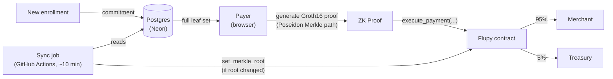

<div align="center">
  <h1>Flupy</h1>
  <p>Privacy-preserving payment infrastructure on Stellar Soroban.</p>

  
  
  
</div>

---

Flupy is an open-source, non-custodial payment gateway: a payer proves
membership in a whitelist without revealing their identity, using a
Groth16 zero-knowledge proof over a Poseidon Merkle tree, then settles a
USDC payment atomically on Stellar Soroban — 95% to the merchant, 5% to
the protocol treasury. Only the payer's identity is private; the
merchant, amount, and settlement are transparent on-chain, by design.

## Table of Contents

- [How it works](#how-it-works)
- [Deployed contract (testnet)](#deployed-contract-testnet)
- [Repository layout](#repository-layout)
- [Running locally](#running-locally)
- [Trying the app](#trying-the-app)
- [Design notes](#design-notes)
- [Roadmap](#roadmap)

## How it works



A proof binds to the exact merchant, payer, and amount it was generated
for — a captured proof can't be replayed with different values. The
contract accepts a proof against any of its last 30 anchored Merkle
roots, so a proof generated a few minutes before the automated sync job
runs still succeeds. Root updates are signed by a `RootOperator` key
that can only update the root — never move funds, pause payments, or
change fees — kept separate from the `Admin` key that can.

## Deployed contract (testnet)

| Contract | Address |
| --- | --- |
| Flupy | `CD3GV6AD3DJKLH3DSLZG4I4KPJV5RUUIC4L7FZN626EHIT4ZBYIQ5PJH` |
| USDC (testnet SAC) | `CBIELTK6YBZJU5UP2WWQEUCYKLPU6AUNZ2BQ4WWFEIE3USCIHMXQDAMA` |

## Repository layout

- `contracts/` — Soroban contract (Rust, soroban-sdk v26), modular Groth16
  verifier with pluggable BN254 backend
- `circuits/` — Circom circuit (Poseidon Merkle membership, payer/recipient/
  amount binding) and SnarkJS trusted setup artifacts
- `packages/flupy-core` — protocol primitives (constants, encoding, hashing)
- `packages/flupy-browser` — browser SDK (Merkle client, ZK prover, Stellar/
  Freighter transaction layer)
- `packages/flupy-react` — React hooks built on `@flupy/browser`
- `app/` — Next.js frontend (landing page, payment demo, developer docs)
- `.github/workflows/` — automated Merkle root sync scheduler

## Running locally

Frontend:

```bash
cd app
pnpm install
pnpm dev
```

Contract tests:

```bash
cd contracts
cargo test -- --nocapture
```

SDK build (from repo root, in dependency order):

```bash
pnpm build:core && pnpm build:browser && pnpm build:react && pnpm build:app
```

## Trying the app

1. Install a Stellar wallet (Freighter works well) and switch it to testnet.
2. Open the live demo and create a ZK credential (password-protected,
   encrypted in IndexedDB — the raw secret never leaves your browser).
3. Connect your wallet and run a payment. Watch the proof generate in the
   browser, verify locally, then settle atomically on-chain.
4. Check the transaction on [Stellar Expert](https://stellar.expert/explorer/testnet)
   — merchant and treasury both receive their share in the same transaction.

## Design notes

- The circuit does no range checks or business logic on `amount` — it's a
  public pass-through signal, bound exactly to the real transfer amount.
  Any spending-policy limits belong in the application, not the circuit.
- `payerHash` binds a proof to the wallet submitting it. Without this, a
  captured-but-unconfirmed proof could be resubmitted by a different
  wallet, burning the original sender's nullifier at no cost to the
  attacker — not fund theft (Flupy is non-custodial), but a griefing
  vector against legitimate payments.
- The Merkle proof-fetch endpoint serves the same full leaf set to every
  caller and lets the client compute its own path locally, rather than
  accepting a per-commitment lookup — the latter would let the server
  infer "this session is about to pay, right now" from request timing.
- Enrollment never touches the chain, which is itself a privacy property:
  there's no on-chain timestamp to correlate against a later payment.
  Flupy's privacy guarantee is on-ledger privacy (the chain can't link a
  payment to an identity), not privacy-from-operator — the enrollment
  server does know the commitment-to-requester mapping, by the nature of
  a gated whitelist.
- Root updates are pushed into a 30-entry ring buffer instead of
  overwriting a single stored value, so a proof generated against a
  slightly older root still succeeds after the automated sync job
  anchors a newer one.

## Roadmap

- Native on-chain BN254 pairing verification (`--features bn254_native`
  is compile-clean against Protocol 26; pending a real-proof integration
  test and cost measurement before flipping the default)
- Multi-party trusted setup ceremony ahead of any mainnet deployment
- External security audit
- Public npm package publication for `@flupy/*`
- Move Groth16 proof generation into a Web Worker, off the browser main thread
- Circuit artifact checksum validation (WASM, zkey, verification key)
- Mobile layout and performance testing
- Production-hardened API rate limiting
- Mainnet deployment
