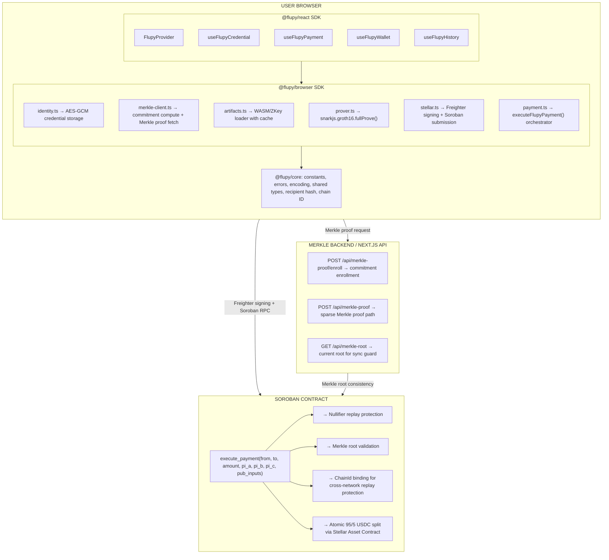

# 🔐 Flupy

### Privacy-Preserving Payment Infrastructure on Stellar Soroban

Flupy is an open-source, non-custodial payment gateway that combines
**Zero-Knowledge Membership Proofs (Groth16 / BN254)** with **atomic on-chain revenue splitting**
— built on Stellar Soroban with a three-layer modular SDK architecture.

> 🏆 **SCF Instawards Candidate** | MIT Licensed | Fully Open Source

[]()
[]()
[]()
[]()
[]()
[]()

---

## 📋 Table of Contents

- [Current Status](#current-status)
- [The Problem](#the-problem)
- [The Innovation](#the-innovation)
- [Architecture](#architecture)
- [SDK Architecture](#sdk-architecture)
- [Key Technical Contributions](#key-technical-contributions)
- [Live Verification](#live-verification)
- [Contract Test Coverage](#contract-test-coverage)
- [Performance Benchmark](#performance-benchmark)
- [Fee Model](#fee-model)
- [Tech Stack](#tech-stack)
- [Getting Started](#getting-started)
- [Developer Commands](#developer-commands)
- [API Routes](#api-routes)
- [Project Structure](#project-structure)
- [Security Notes](#security-notes)
- [Roadmap](#roadmap)
- [Next Integration Plan](#next-integration-plan)
- [Out of Scope for Current MVP](#out-of-scope)
- [Team](#team)
- [License](#license)

---

<a id="current-status"></a>

## 🚦 Current Status

**Phase 3D — Production Testnet E2E Success + Full SDK Integration**

Flupy has successfully reached a production-candidate Testnet milestone with a complete
three-layer SDK architecture and validated incremental app integration.

The deployed Vercel frontend successfully:

- loads Groth16 circuit artifacts from production static assets,
- generates Groth16 proofs in the browser,
- verifies proofs locally before submission,
- checks Merkle root synchronization against the Soroban contract,
- signs transactions through Freighter,
- submits Soroban `execute_payment` calls,
- confirms transactions on Stellar Testnet,
- persists local transaction history in the browser.

The `@flupy/react` SDK integration into the app is now complete through SDK-1C-6:

- `useFlupyHistory` — transaction history aligned to SDK localStorage persistence (SDK-1C-6A)
- `useFlupyWallet` — Freighter wallet state bridged to SDK hook (SDK-1C-6B)
- `FlupyProvider` — SDK context provider integrated into `/app` route subtree (SDK-1C-6C)
- `useFlupyPayment` — experimental SDK payment path validated end-to-end on Testnet (SDK-1C-6D)

Two independent E2E payment paths are now confirmed on Stellar Testnet:

1. **Primary path** — stable production payment via `executeFlupyPayment()` from `@flupy/browser`
2. **SDK hook path** — experimental payment via `useFlupyPayment()` from `@flupy/react`

Both paths produce valid on-chain transactions with confirmed 95/5 atomic splits.

Current deployment:

```text
https://flupy.vercel.app/app
```

---

<a id="the-problem"></a>

## 🌍 The Problem

Existing payment systems on Soroban still have two unresolved gaps:

1. **No privacy-preserving eligibility layer** — users often need to expose raw credentials
   such as student IDs, national IDs, or membership data to prove eligibility. On public ledgers,
   exposing raw identity data creates long-term privacy and data-risk concerns.

2. **No trustless revenue distribution** — merchants often split payments manually off-chain,
   creating reconciliation overhead, counterparty risk, and limited transparency.

Flupy solves both in one payment flow: users prove eligibility privately, then the contract
settles the payment atomically.

---

<a id="the-innovation"></a>

## 💡 The Innovation

> **Private eligibility proof + transparent atomic on-chain settlement.**

Flupy separates *what a user proves* from *what a user reveals*.

Users generate a Zero-Knowledge membership proof in the browser. The protocol verifies that the
user belongs to an approved Merkle set without exposing the underlying credential or raw identity
data.

The payment then settles through a Soroban smart contract using an atomic 95/5 split:

* **95%** goes to the merchant.
* **5%** goes to the protocol treasury.
* The split is executed on-chain in a single payment transaction.

---

<a id="architecture"></a>

## 🏗️ Architecture



### Current Verification Strategy

The current Stellar Testnet MVP enforces browser-side `snarkjs.groth16.verify()` before contract submission and uses a demo-mode verifier strategy on-chain while the production native BN254 pairing path remains pending stable Soroban SDK host-function exposure.

This means:

* Groth16 proof generation happens in the browser.
* Local Groth16 verification is enforced before submission.
* The contract validates Merkle root, nullifier replay protection, chainId binding, recipient hash, amount bounds, and atomic settlement logic.
* Native production BN254 on-chain pairing verification is planned for a future phase once the Soroban SDK exposes a stable host-function path.

---

<a id="sdk-architecture"></a>

## 📦 SDK Architecture

Flupy is structured as a pnpm monorepo with a reusable three-layer SDK.

| Package           | Status     | Description                                                                                                   |
| ----------------- | ---------- | ------------------------------------------------------------------------------------------------------------- |
| `@flupy/core`    | ✅ Complete | Pure TypeScript protocol primitives: constants, errors, encoding, shared types, recipient hash, chain ID      |
| `@flupy/browser` | ✅ Complete | Browser SDK: Merkle client, artifact loader, ZK prover, identity, Stellar/Freighter, payment orchestrator     |
| `@flupy/react`   | ✅ Complete | React SDK: `FlupyProvider`, `useFlupyCredential`, `useFlupyPayment`, `useFlupyWallet`, `useFlupyHistory` |

> Note: The SDK packages are currently internal monorepo packages and have not yet been published to npm.

---

### `@flupy/core` — Protocol Primitives

| Module              | Description                                                                   |
| ------------------- | ----------------------------------------------------------------------------- |
| `constants.ts`      | BN254 field constants, circuit depth, public signal count, protocol constants |
| `errors.ts`         | Shared protocol error classes and error typing                                |
| `encoding.ts`       | G1/G2 proof encoding helpers for Soroban wire format                          |
| `types.ts`          | Shared protocol types such as Merkle proof and payment proof output           |
| `recipient-hash.ts` | BN254-safe recipient hash utility from Stellar addresses                      |
| `chain-id.ts`       | Network passphrase to chainId helper for cross-network replay protection      |

---

### `@flupy/browser` — Browser SDK

| Module             | Description                                                                            |
| ------------------ | -------------------------------------------------------------------------------------- |
| `merkle-client.ts` | Computes commitment locally and requests Merkle proof paths from the backend           |
| `artifacts.ts`     | Loads and caches circuit WASM and ZKey artifacts                                       |
| `prover.ts`        | Generates Groth16 proofs with SnarkJS and performs local verification                  |
| `identity.ts`      | Manages encrypted browser credentials using IndexedDB, PBKDF2, and AES-GCM             |
| `stellar.ts`       | Handles Freighter signing, Soroban simulation, submission, and transaction polling     |
| `payment.ts`       | Provides `executeFlupyPayment()` orchestration across Merkle, ZK, and Stellar modules |

---

### `@flupy/react` — React SDK

| Hook / Component      | Description                                                                                                               |
| --------------------- | ------------------------------------------------------------------------------------------------------------------------- |
| `FlupyProvider`      | React context provider for Flupy configuration such as `stellarConfig`, `networkPassphrase`, and optional Merkle options |
| `useFlupyCredential` | Credential lifecycle hook: create, unlock, remove, refresh, error reset                                                   |
| `useFlupyPayment`    | Payment lifecycle hook built on `executeFlupyPayment()` with status, progress, tx hash, abort, and reset controls        |
| `useFlupyWallet`     | Freighter wallet connection hook using dynamic imports for SSR safety                                                     |
| `useFlupyHistory`    | Local payment history hook with `bigint` serialization and localStorage persistence                                       |

React SDK properties:

* No Next.js dependency.
* No Sentry dependency.
* No toast/UI dependency.
* No `app/src` imports.
* No hardcoded merchant address.
* No hardcoded amount.
* SSR-safe hooks: no browser-only APIs are called during render.
* Secret is never stored in React state.
* Password is never stored in React state.
* Payment history does not store secrets, passwords, or raw proofs.
* Public callbacks are memoized with `useCallback`.
* Payment cancellation is supported through `AbortController` / `AbortSignal`.

---

<a id="key-technical-contributions"></a>

## 🌟 Key Technical Contributions

### 1. Browser-Side ZK Membership Proofs

* Circuit stack: **Circom + SnarkJS + Groth16**
* Hashing: **Poseidon-based Merkle membership proof**
* Proof generated directly in the browser
* Local verification with `snarkjs.groth16.verify()` before transaction submission
* No raw password or raw secret is logged by the SDK

### 2. Atomic 95/5 USDC Settlement

* Single Soroban contract payment flow
* 95% automatically settles to the merchant
* 5% automatically settles to the protocol treasury
* Split is executed atomically, reducing off-chain reconciliation risk

### 3. Nullifier Replay Protection

* Each payment proof includes a nullifier
* The contract marks nullifiers as spent
* Reusing the same nullifier is rejected

### 4. ChainId Binding

* Proof input is bound to the Stellar network passphrase
* Prevents cross-network replay between environments

### 5. Three-Layer Modular SDK

The app has been refactored from a monolithic frontend flow into reusable SDK modules:

```text
@flupy/core
  → protocol primitives
  → constants, errors, encoding, shared types
  → recipient hash and chain ID utilities

@flupy/browser
  → Merkle client
  → artifact loader
  → ZK prover
  → browser identity
  → Stellar/Freighter payment submit
  → payment orchestrator

@flupy/react
  → FlupyProvider
  → useFlupyCredential
  → useFlupyPayment
  → useFlupyWallet
  → useFlupyHistory
```

The incremental app integration with `@flupy/react` is now complete through SDK-1C-6,
with both the primary payment path and the experimental SDK hook path validated
end-to-end on Stellar Testnet.

---

<a id="live-verification"></a>

## 🚀 Live Verification

### Production Testnet App

```text
https://flupy.vercel.app/app
```

### Stellar Testnet

| Item                                       | Value                                                                                                         |
| ------------------------------------------ | ------------------------------------------------------------------------------------------------------------- |
| Contract ID                                | `CAGJIQ4W5Q7ZAYJ2QLH4M4TRIZJHFSDDJZ43PYAR4QEZVP76FTBDIBAS`                                                    |
| Latest Confirmed Payment (primary path)    | `ca6227fd5c426cc2ab1dbd9c2ee2fb6a4fce16fb0b87412408d3a5cbe405b244`                                            |
| Latest Confirmed Payment (SDK hook path)   | `bcc57200a6590db53a7cea6fd6aa02911bdd6001f5a7892b77e6451066b38cbe`                                            |
| Explorer (primary)                         | `https://stellar.expert/explorer/testnet/tx/ca6227fd5c426cc2ab1dbd9c2ee2fb6a4fce16fb0b87412408d3a5cbe405b244` |
| Explorer (SDK hook)                        | `https://stellar.expert/explorer/testnet/tx/bcc57200a6590db53a7cea6fd6aa02911bdd6001f5a7892b77e6451066b38cbe` |
| USDC Contract                              | `CBIELTK6YBZJU5UP2WWQEUCYKLPU6AUNZ2BQ4WWFEIE3USCIHMXQDAMA`                                                    |

### Payment E2E Evidence

Latest validated production Testnet payment flow (primary path):

```text
credential:decrypt              ✓
Merkle proof received           ✓
Frontend root matches contract  ✓
Groth16 proof generated         ✓
Local verification              ✓ VALID
Freighter signing               ✓
Transaction submitted           ✓
Transaction confirmed           ✓
Trace summary                   SUCCESS
```

Latest validated Testnet payment via `useFlupyPayment` SDK hook path (SDK-1C-6D):

```text
FlupyProvider context          ✓ (SDK-1C-6C)
useFlupyCredential unlock      ✓
Merkle proof received           ✓
Groth16 proof generated         ✓
Local verification              ✓ VALID
Freighter signing               ✓
Transaction submitted           ✓
Transaction confirmed           ✓
95/5 atomic split               ✓ (9,500,000 + 500,000 stroops)
Nullifier marked spent          ✓
```

Runtime evidence from deployed Vercel app:

```text
[artifacts] Loaded: WASM=2243297 bytes | ZKEY=5913232 bytes
[prover] Proof generated: pi_a=64B pi_b=128B pi_c=64B
[stellar] Simulating transaction...
[stellar] Awaiting Freighter signature...
[stellar] Submitting transaction to the network...
[stellar] ✓ Transaction confirmed
```

Proof output size:

```text
pi_a = 64B
pi_b = 128B
pi_c = 64B
```

### Production Artifact Verification

Flupy serves production circuit artifacts from:

```text
/circuit/v3/flupy_payment.wasm
/circuit/v3/circuit_final.zkey.bin
/circuit/v3/verification_key.json
```

The proving key artifact is served as `.zkey.bin` for Vercel static deployment compatibility.

Verify deployed artifacts:

```bash
curl -I https://flupy.vercel.app/circuit/v3/flupy_payment.wasm
curl -I https://flupy.vercel.app/circuit/v3/circuit_final.zkey.bin
curl -I https://flupy.vercel.app/circuit/v3/verification_key.json
```

Expected result:

```text
HTTP/2 200
```

Observed artifact sizes:

```text
flupy_payment.wasm       = 2,243,297 bytes
circuit_final.zkey.bin    = 5,913,232 bytes
verification_key.json     = 4,028 bytes
```

### Merkle Root Sync Evidence

The frontend verifies Merkle root synchronization before proof generation.

Contract root from `/api/merkle-root`:

```text
01d36b99df9115ab2d12fc7a0d8ad24c73e1f0e99a8186161b30bd0981756972
```

Merkle proof root from `/api/merkle-proof`:

```text
825860214526777548768231888040603757085006455794519490744185581216954935666
```

The Merkle proof decimal root converts to the same hexadecimal root stored in the contract:

```text
01d36b99df9115ab2d12fc7a0d8ad24c73e1f0e99a8186161b30bd0981756972
```

Result:

```text
frontend/backend Merkle root == on-chain contract Merkle root
```

### SDK Validation Evidence

```text
@flupy/core     build ✓   typecheck ✓
@flupy/browser  build ✓   typecheck ✓
@flupy/react    build ✓   typecheck ✓
Next.js app      build ✓
```

Validation status:

* `pnpm build:core` succeeded.
* `pnpm build:browser` succeeded.
* `pnpm build:react` succeeded.
* `pnpm --filter @flupy/react typecheck` succeeded.
* `pnpm build:app` succeeded.
* Full incremental app integration with `@flupy/react` completed through SDK-1C-6.
* Both primary and SDK hook payment paths validated end-to-end on Stellar Testnet.

---

<a id="contract-test-coverage"></a>

## ✅ Contract Test Coverage

```bash
cargo test -- --nocapture
```

```text
test result: ok. 22 passed; 0 failed; 0 ignored
```

Coverage includes:

* Contract initialization
* Constructor guard
* Admin authorization
* Merkle root update
* Wrong Merkle root rejection
* Nullifier replay rejection
* Payment marks nullifier as spent
* Pause / unpause behavior
* Fee cap validation
* Atomic split precision
* Successful payment flow
* Distinct nullifiers succeeding independently

---

<a id="performance-benchmark"></a>

## ⚡ Performance Benchmark

### Merkle Backend Optimization

The initial Merkle proof API rebuilt a full depth-20 tree on proof requests, which could take
around **120–195 seconds** and made the payment flow impractical for users.

Flupy now uses a sparse Merkle tree strategy with cached zero hashes and module-level singleton
state.

| Metric            | Before           | After                                   |
| ----------------- | ---------------- | --------------------------------------- |
| Full tree rebuild | ~120–195 seconds | Eliminated                              |
| Cold proof path   | ~120–195 seconds | ~0.7–3 seconds depending on cache/state |
| Warm proof path   | ~120–195 seconds | ~14ms observed in validation            |

This is an orders-of-magnitude improvement. In warm-cache validation, the benchmark represents
roughly a **10,000x+ speedup** compared to the original full-tree rebuild path.

---

<a id="fee-model"></a>

## 💰 Fee Model

| Party                | Responsibility                                                             |
| -------------------- | -------------------------------------------------------------------------- |
| User                 | Signs transaction through Freighter                                        |
| User                 | Pays the payment amount                                                    |
| User                 | Pays Stellar/Soroban network transaction fee through wallet                |
| Contract             | Splits payment atomically: 95% merchant, 5% protocol treasury              |
| Developer / Merchant | Does not sponsor user network fees in the current MVP                      |
| Protocol fee         | Taken from within the payment amount, not charged separately to developers |

### Current MVP

Flupy does **not** operate a production relayer in the current MVP.

Flupy does **not** sponsor user network fees in the current MVP.

All payments are user-signed through Freighter.

Observed successful Testnet transaction fee:

```text
0.0031808 XLM
```

### Future Phase

An optional relayer-based transaction sponsorship model may be explored for enrolled merchants in
a future phase. This is not part of the current Testnet MVP.

API keys and merchant access controls are planned as a future merchant/developer integration layer.
They are not a production billing system in the current MVP.

---

<a id="tech-stack"></a>

## 🧩 Tech Stack

| Layer            | Technology                   |
| ---------------- | ---------------------------- |
| Smart Contracts  | Rust, Soroban SDK            |
| ZK Circuits      | Circom, SnarkJS, Groth16     |
| ZK Hashing       | Poseidon-based Merkle tree   |
| Core SDK         | TypeScript, tsup             |
| Browser SDK      | TypeScript, tsup             |
| React SDK        | React 18+, TypeScript, tsup  |
| Identity Storage | IndexedDB, PBKDF2, AES-GCM   |
| Wallet           | Freighter API                |
| Frontend         | Next.js 16, Tailwind CSS     |
| Blockchain       | Stellar Testnet, Soroban RPC |
| Deployment       | Vercel                       |

---

<a id="getting-started"></a>

## 📦 Getting Started

### Prerequisites

* Node.js v18+
* pnpm
* Rust
* Stellar CLI
* Freighter Wallet

### 1. Clone Repository

```bash
git clone https://github.com/dzakwannajmi/Flupy.git
cd flupy
```

### 2. Install Dependencies

```bash
pnpm install
rustup target add wasm32-unknown-unknown
```

### 3. Configure Environment

```bash
cp app/.env.example app/.env.local
```

```env
NEXT_PUBLIC_CONTRACT_ID=CAGJIQ4W5Q7ZAYJ2QLH4M4TRIZJHFSDDJZ43PYAR4QEZVP76FTBDIBAS
NEXT_PUBLIC_RPC_URL=https://soroban-testnet.stellar.org:443
NEXT_PUBLIC_HORIZON_URL=https://horizon-testnet.stellar.org
NEXT_PUBLIC_NETWORK_PASSPHRASE=Test SDF Network ; September 2015
NEXT_PUBLIC_SENTRY_DSN=
SENTRY_ORG=
SENTRY_PROJECT=
SENTRY_AUTH_TOKEN=
```

### 4. Run App Locally

```bash
cd app
pnpm dev
```

### 5. Verify Local Circuit Artifacts

Required local files:

```text
app/public/circuit/v3/flupy_payment.wasm
app/public/circuit/v3/circuit_final.zkey.bin
app/public/circuit/v3/verification_key.json
```

Local artifact check:

```bash
curl -I http://localhost:3000/circuit/v3/flupy_payment.wasm
curl -I http://localhost:3000/circuit/v3/circuit_final.zkey.bin
curl -I http://localhost:3000/circuit/v3/verification_key.json
```

---

<a id="developer-commands"></a>

## 🛠 Developer Commands

| Command                                   | Description                        |
| ----------------------------------------- | ---------------------------------- |
| `pnpm install`                            | Install workspace dependencies     |
| `pnpm build:core`                         | Build `@flupy/core`               |
| `pnpm --filter @flupy/core typecheck`    | Typecheck `@flupy/core`           |
| `pnpm build:browser`                      | Build `@flupy/browser`            |
| `pnpm --filter @flupy/browser typecheck` | Typecheck `@flupy/browser`        |
| `pnpm build:react`                        | Build `@flupy/react`              |
| `pnpm --filter @flupy/react typecheck`   | Typecheck `@flupy/react`          |
| `pnpm build:app`                          | Build the Next.js frontend         |
| `cargo test -- --nocapture`               | Run Soroban contract tests         |
| `stellar contract build`                  | Build Soroban contract WASM        |
| `stellar contract deploy`                 | Deploy contract to Stellar network |

Recommended validation sequence:

```bash
pnpm build:core
pnpm build:browser
pnpm build:react
pnpm --filter @flupy/react typecheck
pnpm build:app
```

Production artifact validation:

```bash
curl -I https://flupy.vercel.app/circuit/v3/flupy_payment.wasm
curl -I https://flupy.vercel.app/circuit/v3/circuit_final.zkey.bin
curl -I https://flupy.vercel.app/circuit/v3/verification_key.json
```

Contract root validation:

```bash
curl https://flupy.vercel.app/api/merkle-root
```

---

<a id="api-routes"></a>

## 🌐 API Routes

### `POST /api/merkle-proof/enroll`

Enrolls a commitment into the current Testnet Merkle tree.

This endpoint is used for mock/Testnet onboarding and does not receive raw secrets.

### `POST /api/merkle-proof`

Returns a Merkle membership proof for an enrolled commitment.

Response includes:

```json
{
  "pathElements": [],
  "pathIndices": [],
  "root": "..."
}
```

### `GET /api/merkle-root`

Returns the active Merkle root stored in the Soroban contract.

This endpoint is used by the frontend root sync guard to prevent stale proof generation.

---

<a id="project-structure"></a>

## 📁 Project Structure

```text
flupy/
├── app/
│   ├── src/
│   │   ├── app/
│   │   │   └── app/
│   │   │       ├── layout.tsx         (FlupyAppProvider wrapper)
│   │   │       ├── providers.tsx      (FlupyProvider config — SDK-1C-6C)
│   │   │       └── page.tsx           (integrated: history, wallet, provider, payment)
│   │   ├── hooks/
│   │   │   └── useFlupy.ts
│   │   └── lib/
│   │       ├── errorMapper.ts
│   │       ├── history.ts
│   │       ├── identity.ts
│   │       ├── merkle.ts
│   │       ├── sentryCapture.ts
│   │       ├── stellar.ts
│   │       ├── telemetry.ts
│   │       └── zkp.ts
│   └── public/
│       └── circuit/
│           └── v3/
│               ├── flupy_payment.wasm
│               ├── circuit_final.zkey.bin
│               └── verification_key.json
│
├── packages/
│   ├── flupy-core/
│   │   └── src/
│   │       ├── constants.ts
│   │       ├── errors.ts
│   │       ├── encoding.ts
│   │       ├── types.ts
│   │       ├── recipient-hash.ts
│   │       └── chain-id.ts
│   │
│   ├── flupy-browser/
│   │   └── src/
│   │       ├── merkle-client.ts
│   │       ├── artifacts.ts
│   │       ├── prover.ts
│   │       ├── identity.ts
│   │       ├── stellar.ts
│   │       └── payment.ts
│   │
│   └── flupy-react/
│       └── src/
│           ├── provider.tsx
│           ├── types.ts
│           ├── hooks.ts
│           ├── useFlupyCredential.ts
│           ├── useFlupyPayment.ts
│           ├── useFlupyWallet.ts
│           └── useFlupyHistory.ts
│
├── circuits/
│   ├── FlupyPayment.circom
│   ├── input.json
│   ├── proof.json
│   ├── public.json
│   └── vkey.json
│
├── contracts/
│   └── src/
│       ├── verifier/
│       │   ├── mod.rs
│       │   ├── types.rs
│       │   ├── vk_constants.rs
│       │   ├── bn254_demo.rs
│       │   └── bn254_native.rs
│       ├── payment.rs
│       ├── errors.rs
│       └── lib.rs
│
├── scripts/
├── pnpm-workspace.yaml
└── README.md
```

---

<a id="security-notes"></a>

## 🔐 Security Notes

* Raw passwords are never stored.
* Raw passwords are never logged.
* Raw ZK secrets are never logged by the SDK.
* Raw ZK secrets are not stored in React state.
* Raw proofs are not logged by the React SDK.
* Browser credentials are encrypted with PBKDF2 + AES-GCM and stored in IndexedDB.
* Proof generation happens locally in the browser.
* Local proof verification is enforced before contract submission in the current development flow.
* Frontend/backend Merkle root is compared against the on-chain contract root before proof generation.
* `useFlupyHistory` stores transaction metadata only; it does not store secrets, passwords, or raw proofs.
* `useFlupyWallet` stores only the public wallet address.
* Current MVP uses user-signed Freighter transactions.
* Current MVP does not include a production relayer.
* Current MVP does not include gas sponsorship.
* API keys and merchant access controls are planned for a future integration layer.

### Current On-Chain Verification Limitation

The current Testnet MVP uses a demo-mode on-chain verifier backend while browser-side `snarkjs.groth16.verify()` is enforced before every contract submission.

Native BN254 on-chain pairing verification is planned for a future phase once the Soroban SDK exposes a stable host-function path.

---

<a id="roadmap"></a>

## 🗺️ Roadmap

| Phase    | Milestone                                                                      | Status      |
| -------- | ------------------------------------------------------------------------------ | ----------- |
| Phase 1  | Soroban contract + ZK circuit + Testnet MVP                                    | ✅ Complete  |
| Phase 2  | Merkle backend performance optimization                                        | ✅ Complete  |
| Phase 3  | `@flupy/core` protocol primitives                                             | ✅ Complete  |
| Phase 4  | `@flupy/browser` SDK extraction                                               | ✅ Complete  |
| Phase 5  | `@flupy/react` hooks and provider                                             | ✅ Complete  |
| Phase 6  | Production Testnet E2E validation on Vercel                                    | ✅ Complete  |
| Phase 7  | Incremental app integration with `@flupy/react` (SDK-1C-6A through 6D)       | ✅ Complete  |
| Phase 8  | Runtime hardening: Web Worker proof generation, timeout, artifact checksum     | 📋 Next     |
| Phase 9  | Backend hardening: persistent Merkle storage, rate limiting, merchant API keys | 📋 Planned  |
| Phase 10 | External security audit and audit-readiness review                             | 📋 Planned  |
| Phase 11 | Optional relayer sponsorship model                                             | 📋 Future   |
| Phase 12 | Mainnet deployment                                                             | 📋 Future   |

---

<a id="next-integration-plan"></a>

## 🔄 Next Integration Plan

After the full SDK integration milestone, the next phase focuses on hardening the runtime and
backend before deeper production readiness.

### 1. Runtime Hardening

* Move Groth16 proof generation into a Web Worker to avoid blocking the browser main thread.
* Add proof generation timeout handling.
* Add cancellation-safe proof lifecycle handling.
* Add artifact checksum validation for WASM, ZKey, and `verification_key.json`.
* Add offline artifact preload to improve first-payment UX.
* Run mobile performance tests on Android and iOS browsers.

### 2. Backend and Merkle API Hardening

* Replace the current mock/in-memory Merkle enrollment flow with persistent storage.
* Add rate limiting for Merkle proof API usage.
* Add merchant/developer API key authentication.
* Add access control for enrollment and Merkle proof requests.
* Add a root rebuild workflow for admin-controlled enrollment updates.
* Keep API key support as a future merchant/developer integration layer, not a production billing system in the current MVP.

### 3. SDK Integration (Completed)

The incremental `@flupy/react` app integration is now complete through SDK-1C-6:

* **SDK-1C-6A** — `useFlupyHistory` aligned to localStorage persistence key `flupy:payment-history:v1`.
* **SDK-1C-6B** — `useFlupyWallet` bridged to existing Freighter wallet connection flow.
* **SDK-1C-6C** — `FlupyProvider` integrated into `/app` route subtree via `providers.tsx` and `layout.tsx`.
* **SDK-1C-6D** — `useFlupyPayment` experimental SDK hook path validated end-to-end on Stellar Testnet.

Both the primary payment path (`executeFlupyPayment` from `@flupy/browser`) and the SDK hook
path (`useFlupyPayment` from `@flupy/react`) are now confirmed on Stellar Testnet with valid
on-chain 95/5 atomic splits.

### 4. Grant Documentation and Demo Evidence

* README and SOW evidence updated to reflect the completed three-layer SDK architecture and
  incremental app integration milestone.
* Production Testnet evidence included from the deployed Vercel application.
* Two independent E2E payment paths confirmed and documented.

### 5. External Security Audit

* Target subsidized audit support through SCF Soroban Audit Bank.
* Prepare an audit package covering:

  * immutable initialization
  * deterministic proof encoding
  * nullifier replay protection
  * Merkle root controls
  * atomic 95/5 split settlement
  * chainId binding
  * verifier modularization
* Native BN254 on-chain pairing migration remains planned once the Soroban SDK exposes a stable host-function path.

### 6. SCF Build Award Application

* Prepare a 3–6 month roadmap for Southeast Asia pilot deployment.
* Target markets:

  * Indonesia
  * Vietnam
  * Malaysia
  * Singapore
  * Thailand
* Expand toward merchant onboarding, persistent Merkle enrollment, API key access control, and optional future relayer-based transaction sponsorship.
* Keep mainnet deployment, production relayer infrastructure, and full merchant admin operations outside the current Instawards MVP scope.

---

<a id="out-of-scope"></a>

## 🚧 Out of Scope for Current MVP

The following are intentionally out of scope for the current Testnet MVP:

* Mainnet deployment
* Production relayer
* Gasless payment sponsorship
* API key billing system
* Public npm package publication for `@flupy/core`, `@flupy/browser`, or `@flupy/react`
* Production merchant dashboard
* Full KYC/AML provider integration
* Production database hardening
* Multi-token support beyond USDC
* Native production BN254 pairing verification path
* External audit completion
* Multisig admin controls

---

<a id="team"></a>

## 👥 Team

| Role              | Contributor   |
| ----------------- | ------------- |
| Protocol Engineer | @dzakwannajmi |

---

<a id="license"></a>

## 📜 License

MIT License

```
Copyright (c) 2026 Muhammad Dzakwan Najmi

Permission is hereby granted, free of charge, to any person obtaining a copy
of this software and associated documentation files (the "Software"), to deal
in the Software without restriction, including without limitation the rights
to use, copy, modify, merge, publish, distribute, sublicense, and/or sell
copies of the Software, and to permit persons to whom the Software is
furnished to do so, subject to the following conditions:

The above copyright notice and this permission notice shall be included in all
copies or substantial portions of the Software.

THE SOFTWARE IS PROVIDED "AS IS", WITHOUT WARRANTY OF ANY KIND, EXPRESS OR
IMPLIED, INCLUDING BUT NOT LIMITED TO THE WARRANTIES OF MERCHANTABILITY,
FITNESS FOR A PARTICULAR PURPOSE AND NONINFRINGEMENT. IN NO EVENT SHALL THE
AUTHORS OR COPYRIGHT HOLDERS BE LIABLE FOR ANY CLAIM, DAMAGES OR OTHER
LIABILITY, WHETHER IN AN ACTION OF CONTRACT, TORT OR OTHERWISE, ARISING FROM,
OUT OF OR IN CONNECTION WITH THE SOFTWARE OR THE USE OR OTHER DEALINGS IN THE
SOFTWARE.
```