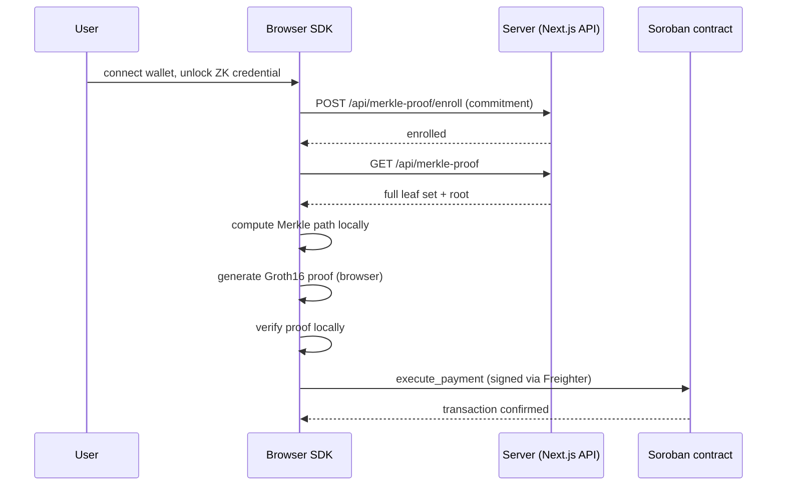

<div align="center">
  <h1>Flupy Frontend</h1>
  <p>Next.js app — browser ZK proving, Freighter wallet, payment demo, developer docs.</p>
</div>

---

Browser-side ZK proof generation, Freighter wallet integration, Merkle
proof retrieval, Soroban transaction submission, and the developer
documentation site.

> **Testnet only.** See the [Security Model docs](https://flupy-app-dzakwannajmis-projects.vercel.app/docs/security) for
> the current verifier and audit status.

## Table of Contents

- [Directory structure](#directory-structure)
- [Payment flow](#payment-flow)
- [Tech stack](#tech-stack)
- [Environment configuration](#environment-configuration)
- [Local setup](#local-setup)
- [Key source files](#key-source-files)
- [Circuit artifacts](#circuit-artifacts)
- [API routes](#api-routes)
- [Security architecture](#security-architecture)

## Directory structure

```text
app/
├── src/
│   ├── app/
│   │   ├── page.tsx              # Landing page
│   │   ├── app/page.tsx          # Payment demo UI
│   │   ├── api/
│   │   │   ├── merkle-proof/route.ts          # GET — full leaf set + root
│   │   │   ├── merkle-proof/enroll/route.ts   # POST — enroll a commitment
│   │   │   ├── merkle-root/route.ts           # GET — current on-chain root
│   │   │   └── admin/sync-root/route.ts       # GET — automated root sync
│   │   └── docs/                 # Developer documentation
│   │
│   ├── components/                # Navbar, Footer, CodeBlock, shadcn/ui, etc.
│   ├── hooks/useFlupy.ts          # App-level payment orchestration
│   └── lib/
│       ├── merkle-server/         # Server-side tree cache + Postgres store
│       ├── errorMapper.ts
│       ├── history.ts             # Local transaction history (IndexedDB)
│       ├── identity.ts            # Encrypted credential storage
│       └── stellar.ts             # Soroban XDR + Freighter submit layer
│
└── public/circuit/v3/             # Groth16 circuit artifacts (wasm, zkey, vk)
```

## Payment flow



The proof-fetch step returns the same leaf set to every caller — the
server never learns which commitment is about to be used for payment.
See the [Security Model docs](https://flupy-app-dzakwannajmis-projects.vercel.app/docs/security#merkle) for why.

## Tech stack

| Layer | Technology |
| --- | --- |
| Framework | Next.js 16 App Router |
| ZK proving | Circom + SnarkJS, Groth16 / BN254 |
| Browser/React SDK | `@flupy/browser`, `@flupy/react` |
| Identity storage | IndexedDB + PBKDF2 + AES-GCM |
| Blockchain | `@stellar/stellar-sdk`, `@stellar/freighter-api` |
| Commitment store | Postgres (Neon) |
| Styling | Tailwind CSS v4, shadcn/ui |
| Icons | Iconify (Phosphor) |
| Deployment | Vercel |

## Environment configuration

Create `app/.env.local`:

```env
NEXT_PUBLIC_CONTRACT_ID=CD3GV6AD3DJKLH3DSLZG4I4KPJV5RUUIC4L7FZN626EHIT4ZBYIQ5PJH
NEXT_PUBLIC_RPC_URL=https://soroban-testnet.stellar.org:443
NEXT_PUBLIC_HORIZON_URL=https://horizon-testnet.stellar.org
NEXT_PUBLIC_NETWORK_PASSPHRASE=Test SDF Network ; September 2015

DATABASE_URL=                    # Neon Postgres connection string
FLUPY_ROOT_OPERATOR_SECRET=      # RootOperator signing key (server-side only)
FLUPY_ALLOW_DEMO_ENROLLMENT=     # 'true' to allow enrollment on a testnet demo deployment
```

## Local setup

```bash
cd app
pnpm install
pnpm dev
```

Open `http://localhost:3000/app`.

## Key source files

- **`hooks/useFlupy.ts`** — app-level orchestration: wallet state,
  credential setup, payment execution, root sync validation, local
  proof verification, history updates
- **`lib/merkle-server/`** — server-side tree cache backed by Postgres
  (`postgres-commitment-source.ts`), replacing an earlier in-memory-only
  store that lost data on serverless cold starts
- **`lib/errorMapper.ts`** — maps raw contract/network errors to
  user-facing messages
- **`lib/history.ts`** — local transaction history in IndexedDB;
  stores metadata only, never secrets or raw proofs

## Circuit artifacts

Served from `/circuit/v3/`:

```text
flupy_payment.wasm
circuit_final.zkey.bin
verification_key.json
```

(`.zkey.bin`, not `.zkey` — required for Vercel static asset compatibility.)

## API routes

| Route | Method | Purpose |
| --- | --- | --- |
| `/api/merkle-proof/enroll` | `POST` | Enroll a commitment into the whitelist |
| `/api/merkle-proof` | `GET` | Full leaf set + root, for local path computation |
| `/api/merkle-root` | `GET` | Current on-chain Merkle root |
| `/api/admin/sync-root` | `GET` | Automated sync endpoint (called by GitHub Actions, not user-facing) |

## Security architecture

- Raw credential and secret never leave the browser; the server
  receives only a Poseidon commitment hash
- Cross-Origin-Opener-Policy / Cross-Origin-Embedder-Policy headers
  enabled for WASM proof generation
- Local proof verification (`snarkjs.groth16.verify()`) runs before
  every transaction submission
- Transaction history stores metadata only — no secrets, passwords, or
  raw proofs

See the [Security Model docs](https://flupy-app-dzakwannajmis-projects.vercel.app/docs/security) for the full model.