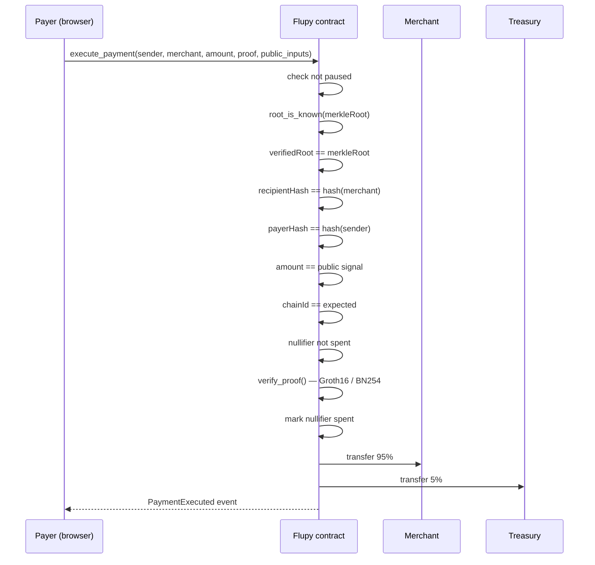

# Flupy Smart Contract — Soroban

> **Testnet only.** The active verifier backend (`bn254_demo`) validates
> proof structure and public inputs but does not yet perform a native
> on-chain BN254 pairing check — see [Verifier Architecture](#verifier-architecture)
> below and the root [`SECURITY.md`](../SECURITY.md).

## Contract

Soroban contract in `contracts/src/`:

- `lib.rs` — entrypoint: `execute_payment`, admin functions (`set_pause`,
  `set_fee`, `set_merkle_root`, `rotate_operator`), and read-only queries
- `payment.rs` — payment execution: binding checks, Groth16 verification
  dispatch, atomic 95/5 settlement
- `verifier/` — modular Groth16 verifier (`types.rs`, `vk_constants.rs`,
  `bn254_demo.rs`, `bn254_native.rs`)
- `errors.rs` — error enum
- `test.rs` — unit tests (31 passing)

Deployed on testnet:

| Item | Value |
| --- | --- |
| Contract | `CD3GV6AD3DJKLH3DSLZG4I4KPJV5RUUIC4L7FZN626EHIT4ZBYIQ5PJH` |
| USDC (testnet SAC) | `CBIELTK6YBZJU5UP2WWQEUCYKLPU6AUNZ2BQ4WWFEIE3USCIHMXQDAMA` |
| RootOperator | `GDTRD3IJA7NQUCACPV2BA2M7QAB54YOR663DYCJVPZWFVQF5BHCSLBHA` |

## Payment execution flow



Public signal ordering (`N_PUBLIC = 7`), aligned across the Circom
circuit, SnarkJS output, browser SDK encoding, and this contract:

```text
[0] nullifier       output
[1] verifiedRoot     output
[2] merkleRoot       public input
[3] recipientHash    public input
[4] payerHash        public input
[5] amount           public input
[6] chainId          public input
```

## Roles

| Role | Key | Capability |
| --- | --- | --- |
| Admin | cold key | Full control: pause, fee, rotate operator; can also update the root directly |
| RootOperator | hot key, held by the automated sync job | Can *only* call `set_merkle_root` — never moves funds, pauses payments, or changes fees. Revocable via `rotate_operator` without a contract upgrade |

## Root history

The contract keeps the last **30 anchored roots** rather than a single
value. `execute_payment` accepts a proof against any root still in that
window, via `is_known_root`. This absorbs the delay between when a proof
is generated and when the next automated sync anchors a newer root — see
[`.github/workflows/sync-merkle-root.yml`](../.github/workflows/sync-merkle-root.yml).

## Verifier architecture

```text
verifier/
├── mod.rs           # public API, backend dispatch
├── types.rs         # Proof, PublicInputs, N_PUBLIC
├── vk_constants.rs  # verification key + BN254 constants
├── bn254_demo.rs    # active testnet backend
└── bn254_native.rs  # native BN254 pairing backend (compile-clean, not yet default)
```

`bn254_native.rs` targets the confirmed Protocol 26 host functions
(`g1_msm`, `g1_add`, `g1_mul`, `pairing_check`) and compiles clean, but
isn't the default build — activating it (`--features bn254_native`)
still needs a real-proof integration test and on-chain cost measurement
first. Client-side `snarkjs.groth16.verify()` runs before every
submission regardless of backend.

## Tests

```bash
cargo test -- --nocapture
```

Coverage includes constructor guards, admin/operator role separation,
Merkle root history acceptance and eviction, payer/recipient/amount
binding rejection, nullifier replay protection, pause behavior, fee
bounds, and atomic split precision.

## Build

```bash
cargo build --target wasm32v1-none --release
cargo check --features bn254_native
```